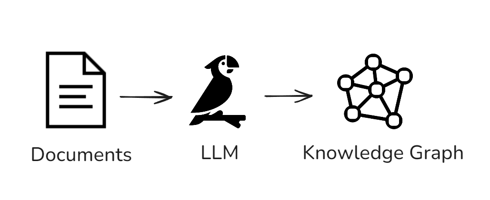

# Introduction
In this project, I develop a simple application that generates a knowledge graph using LLM. The demo can be found [here](https://buildknowledgegraphllm.streamlit.app/).


# Use Case
The application can be used to create a knowledge graph from a set of documents. The knowledge graph can be used to visualize the relationships between different entities and concepts present in the documents.

Here's an overview drawing of the application.



# System overview
The diagram below shows the system overview of the application.


## Steps
The following steps represent the flow of the application:
- The user add a text content in the text area.
- The user clicks on the "Generate Knowledge Graph" button.
- The system prepare the prompt and the text content to be used as input for the LLM model.
- The system sends the input to the LLM model.
- The LLM model generates the knowledge graph.
- The system displays the knowledge graph to the user.

## UI
The following screenshot shows the user interface of the application.


# Setting up a virtual environment
It's recommended to create a virtual environment. Here, we'll be using Conda.

To create a new Conda environment, use the following command:

```bash
conda create --name llm
```

After creating the environment, activate it using:

```bash
conda activate llm
```

Once the Conda environment is activated, you can install the dependencies from the `requirements.txt` file. Use the following command:

```bash
pip install -r requirements.txt
```

# Usage
To run the code, use the following command:

```bash
streamlit run main.py

```